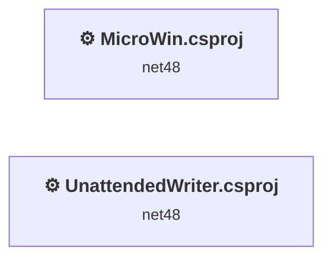
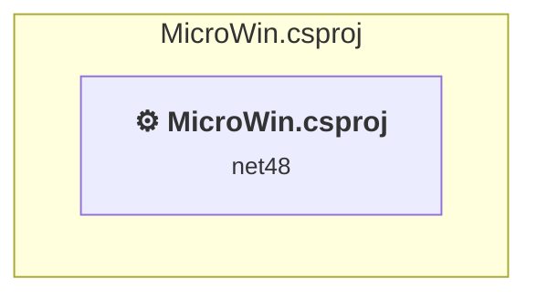
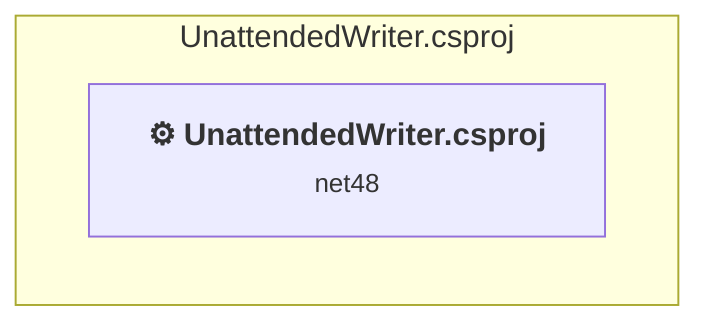

# Projects and dependencies analysis

This document provides a comprehensive overview of the projects and their dependencies in the context of upgrading to .NETCoreApp,Version=v10.0.

## Table of Contents

- [Executive Summary](#executive-Summary)
  - [Highlevel Metrics](#highlevel-metrics)
  - [Projects Compatibility](#projects-compatibility)
  - [Package Compatibility](#package-compatibility)
  - [API Compatibility](#api-compatibility)
- [Aggregate NuGet packages details](#aggregate-nuget-packages-details)
- [Top API Migration Challenges](#top-api-migration-challenges)
  - [Technologies and Features](#technologies-and-features)
  - [Most Frequent API Issues](#most-frequent-api-issues)
- [Projects Relationship Graph](#projects-relationship-graph)
- [Project Details](#project-details)

  - [MicroWin\MicroWin.csproj](#microwinmicrowincsproj)
  - [TestProjects\UnattendedWriter\UnattendedWriter.csproj](#testprojectsunattendedwriterunattendedwritercsproj)

## Executive Summary

### Highlevel Metrics

| Metric | Count | Status |
| :--- | :---: | :--- |
| Total Projects | 2 | All require upgrade |
| Total NuGet Packages | 2 | 1 need upgrade |
| Total Code Files | 29 |  |
| Total Code Files with Incidents | 9 |  |
| Total Lines of Code | 4125 |  |
| Total Number of Issues | 2979 |  |
| Estimated LOC to modify | 2974+ | at least 72,1% of codebase |

### Projects Compatibility

| Project | Target Framework | Difficulty | Package Issues | API Issues | Est. LOC Impact | Description |
| :--- | :---: | :---: | :---: | :---: | :---: | :--- |
| [MicroWin\MicroWin.csproj](#microwinmicrowincsproj) | net48 | 🟡 Medium | 1 | 2974 | 2974+ | ClassicWinForms, Sdk Style = False |
| [TestProjects\UnattendedWriter\UnattendedWriter.csproj](#testprojectsunattendedwriterunattendedwritercsproj) | net48 | 🟢 Low | 0 | 0 |  | ClassicDotNetApp, Sdk Style = False |

### Package Compatibility

| Status | Count | Percentage |
| :--- | :---: | :---: |
| ✅ Compatible | 1 | 50,0% |
| ⚠️ Incompatible | 1 | 50,0% |
| 🔄 Upgrade Recommended | 0 | 0,0% |
| ***Total NuGet Packages*** | ***2*** | ***100%*** |

### API Compatibility

| Category | Count | Impact |
| :--- | :---: | :--- |
| 🔴 Binary Incompatible | 2801 | High - Require code changes |
| 🟡 Source Incompatible | 172 | Medium - Needs re-compilation and potential conflicting API error fixing |
| 🔵 Behavioral change | 1 | Low - Behavioral changes that may require testing at runtime |
| ✅ Compatible | 3647 |  |
| ***Total APIs Analyzed*** | ***6621*** |  |

## Aggregate NuGet packages details

| Package | Current Version | Suggested Version | Projects | Description |
| :--- | :---: | :---: | :--- | :--- |
| Microsoft.Dism | 4.0.7 |  | [MicroWin.csproj](#microwinmicrowincsproj) | ✅Compatible |
| Microsoft.UI.Xaml | 2.8.7 |  | [MicroWin.csproj](#microwinmicrowincsproj) | ⚠️El paquete NuGet no es compatible |

## Top API Migration Challenges

### Technologies and Features

| Technology | Issues | Percentage | Migration Path |
| :--- | :---: | :---: | :--- |
| Windows Forms | 2801 | 94,2% | Windows Forms APIs for building Windows desktop applications with traditional Forms-based UI that are available in .NET on Windows. Enable Windows Desktop support: Option 1 (Recommended): Target net9.0-windows; Option 2: Add <UseWindowsDesktop>true</UseWindowsDesktop>; Option 3 (Legacy): Use Microsoft.NET.Sdk.WindowsDesktop SDK. |
| GDI+ / System.Drawing | 153 | 5,1% | System.Drawing APIs for 2D graphics, imaging, and printing that are available via NuGet package System.Drawing.Common. Note: Not recommended for server scenarios due to Windows dependencies; consider cross-platform alternatives like SkiaSharp or ImageSharp for new code. |
| System Management (WMI) | 17 | 0,6% | Windows Management Instrumentation (WMI) APIs for system administration and monitoring that are available via NuGet package System.Management. These APIs provide access to Windows system information but are Windows-only; consider cross-platform alternatives for new code. |
| Legacy Configuration System | 2 | 0,1% | Legacy XML-based configuration system (app.config/web.config) that has been replaced by a more flexible configuration model in .NET Core. The old system was rigid and XML-based. Migrate to Microsoft.Extensions.Configuration with JSON/environment variables; use System.Configuration.ConfigurationManager NuGet package as interim bridge if needed. |

### Most Frequent API Issues

| API | Count | Percentage | Category |
| :--- | :---: | :---: | :--- |
| T:System.Windows.Forms.Label | 302 | 10,2% | Binary Incompatible |
| T:System.Windows.Forms.AnchorStyles | 271 | 9,1% | Binary Incompatible |
| T:System.Windows.Forms.Panel | 230 | 7,7% | Binary Incompatible |
| T:System.Windows.Forms.LinkLabel | 89 | 3,0% | Binary Incompatible |
| T:System.Windows.Forms.TextBox | 73 | 2,5% | Binary Incompatible |
| T:System.Windows.Forms.Button | 71 | 2,4% | Binary Incompatible |
| P:System.Windows.Forms.Control.Name | 70 | 2,4% | Binary Incompatible |
| P:System.Windows.Forms.Control.Size | 69 | 2,3% | Binary Incompatible |
| P:System.Windows.Forms.Control.Location | 69 | 2,3% | Binary Incompatible |
| P:System.Windows.Forms.Control.TabIndex | 67 | 2,3% | Binary Incompatible |
| T:System.Windows.Forms.TableLayoutPanel | 66 | 2,2% | Binary Incompatible |
| T:System.Windows.Forms.DockStyle | 63 | 2,1% | Binary Incompatible |
| T:System.Windows.Forms.CheckBox | 60 | 2,0% | Binary Incompatible |
| T:System.Windows.Forms.Control.ControlCollection | 56 | 1,9% | Binary Incompatible |
| P:System.Windows.Forms.Control.Controls | 56 | 1,9% | Binary Incompatible |
| M:System.Windows.Forms.Control.ControlCollection.Add(System.Windows.Forms.Control) | 56 | 1,9% | Binary Incompatible |
| P:System.Windows.Forms.Control.Anchor | 39 | 1,3% | Binary Incompatible |
| T:System.Windows.Forms.ProgressBar | 35 | 1,2% | Binary Incompatible |
| P:System.Windows.Forms.Label.Text | 32 | 1,1% | Binary Incompatible |
| F:System.Windows.Forms.AnchorStyles.Right | 32 | 1,1% | Binary Incompatible |
| T:System.Windows.Forms.ColumnHeader | 31 | 1,0% | Binary Incompatible |
| F:System.Windows.Forms.AnchorStyles.Left | 31 | 1,0% | Binary Incompatible |
| T:System.Windows.Forms.PictureBox | 28 | 0,9% | Binary Incompatible |
| T:System.Drawing.GraphicsUnit | 28 | 0,9% | Source Incompatible |
| T:System.Drawing.FontStyle | 28 | 0,9% | Source Incompatible |
| T:System.Drawing.Font | 28 | 0,9% | Source Incompatible |
| F:System.Windows.Forms.AnchorStyles.Top | 28 | 0,9% | Binary Incompatible |
| T:System.Windows.Forms.ListView | 27 | 0,9% | Binary Incompatible |
| T:System.Windows.Forms.SizeType | 26 | 0,9% | Binary Incompatible |
| M:System.Windows.Forms.Label.#ctor | 26 | 0,9% | Binary Incompatible |
| P:System.Windows.Forms.Label.AutoEllipsis | 21 | 0,7% | Binary Incompatible |
| F:System.Windows.Forms.AnchorStyles.Bottom | 21 | 0,7% | Binary Incompatible |
| P:System.Windows.Forms.Control.Dock | 21 | 0,7% | Binary Incompatible |
| F:System.Windows.Forms.DockStyle.Fill | 19 | 0,6% | Binary Incompatible |
| M:System.Windows.Forms.Control.ResumeLayout(System.Boolean) | 18 | 0,6% | Binary Incompatible |
| T:System.Windows.Forms.FlatStyle | 18 | 0,6% | Binary Incompatible |
| T:System.Windows.Forms.LinkBehavior | 18 | 0,6% | Binary Incompatible |
| M:System.Windows.Forms.Control.SuspendLayout | 18 | 0,6% | Binary Incompatible |
| T:System.Windows.Forms.ComboBox | 17 | 0,6% | Binary Incompatible |
| T:System.Windows.Forms.BorderStyle | 15 | 0,5% | Binary Incompatible |
| F:System.Drawing.GraphicsUnit.Point | 14 | 0,5% | Source Incompatible |
| F:System.Drawing.FontStyle.Regular | 14 | 0,5% | Source Incompatible |
| M:System.Drawing.Font.#ctor(System.String,System.Single,System.Drawing.FontStyle,System.Drawing.GraphicsUnit,System.Byte) | 14 | 0,5% | Source Incompatible |
| P:System.Windows.Forms.Control.Font | 14 | 0,5% | Binary Incompatible |
| M:System.Windows.Forms.Panel.#ctor | 14 | 0,5% | Binary Incompatible |
| F:System.Windows.Forms.SizeType.Percent | 13 | 0,4% | Binary Incompatible |
| T:System.Windows.Forms.TableLayoutControlCollection | 13 | 0,4% | Binary Incompatible |
| P:System.Windows.Forms.TableLayoutPanel.Controls | 13 | 0,4% | Binary Incompatible |
| M:System.Windows.Forms.TableLayoutControlCollection.Add(System.Windows.Forms.Control,System.Int32,System.Int32) | 13 | 0,4% | Binary Incompatible |
| T:System.Windows.Forms.DialogResult | 13 | 0,4% | Binary Incompatible |

## Projects Relationship Graph

Legend:
📦 SDK-style project
⚙️ Classic project

## Project Details

### MicroWin\MicroWin.csproj

#### Project Info

- **Current Target Framework:** net48
- **Proposed Target Framework:** net10.0-windows
- **SDK-style**: False
- **Project Kind:** ClassicWinForms
- **Dependencies**: 0
- **Dependants**: 0
- **Number of Files**: 32
- **Number of Files with Incidents**: 8
- **Lines of Code**: 3943
- **Estimated LOC to modify**: 2974+ (at least 75,4% of the project)

#### Dependency Graph

Legend:
📦 SDK-style project
⚙️ Classic project

### API Compatibility

| Category | Count | Impact |
| :--- | :---: | :--- |
| 🔴 Binary Incompatible | 2801 | High - Require code changes |
| 🟡 Source Incompatible | 172 | Medium - Needs re-compilation and potential conflicting API error fixing |
| 🔵 Behavioral change | 1 | Low - Behavioral changes that may require testing at runtime |
| ✅ Compatible | 3385 |  |
| ***Total APIs Analyzed*** | ***6359*** |  |

#### Project Technologies and Features

| Technology | Issues | Percentage | Migration Path |
| :--- | :---: | :---: | :--- |
| Legacy Configuration System | 2 | 0,1% | Legacy XML-based configuration system (app.config/web.config) that has been replaced by a more flexible configuration model in .NET Core. The old system was rigid and XML-based. Migrate to Microsoft.Extensions.Configuration with JSON/environment variables; use System.Configuration.ConfigurationManager NuGet package as interim bridge if needed. |
| System Management (WMI) | 17 | 0,6% | Windows Management Instrumentation (WMI) APIs for system administration and monitoring that are available via NuGet package System.Management. These APIs provide access to Windows system information but are Windows-only; consider cross-platform alternatives for new code. |
| GDI+ / System.Drawing | 153 | 5,1% | System.Drawing APIs for 2D graphics, imaging, and printing that are available via NuGet package System.Drawing.Common. Note: Not recommended for server scenarios due to Windows dependencies; consider cross-platform alternatives like SkiaSharp or ImageSharp for new code. |
| Windows Forms | 2801 | 94,2% | Windows Forms APIs for building Windows desktop applications with traditional Forms-based UI that are available in .NET on Windows. Enable Windows Desktop support: Option 1 (Recommended): Target net9.0-windows; Option 2: Add <UseWindowsDesktop>true</UseWindowsDesktop>; Option 3 (Legacy): Use Microsoft.NET.Sdk.WindowsDesktop SDK. |

### TestProjects\UnattendedWriter\UnattendedWriter.csproj

#### Project Info

- **Current Target Framework:** net48
- **Proposed Target Framework:** net10.0
- **SDK-style**: False
- **Project Kind:** ClassicDotNetApp
- **Dependencies**: 0
- **Dependants**: 0
- **Number of Files**: 2
- **Number of Files with Incidents**: 1
- **Lines of Code**: 182
- **Estimated LOC to modify**: 0+ (at least 0,0% of the project)

#### Dependency Graph

Legend:
📦 SDK-style project
⚙️ Classic project

### API Compatibility

| Category | Count | Impact |
| :--- | :---: | :--- |
| 🔴 Binary Incompatible | 0 | High - Require code changes |
| 🟡 Source Incompatible | 0 | Medium - Needs re-compilation and potential conflicting API error fixing |
| 🔵 Behavioral change | 0 | Low - Behavioral changes that may require testing at runtime |
| ✅ Compatible | 262 |  |
| ***Total APIs Analyzed*** | ***262*** |  |

